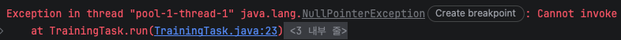
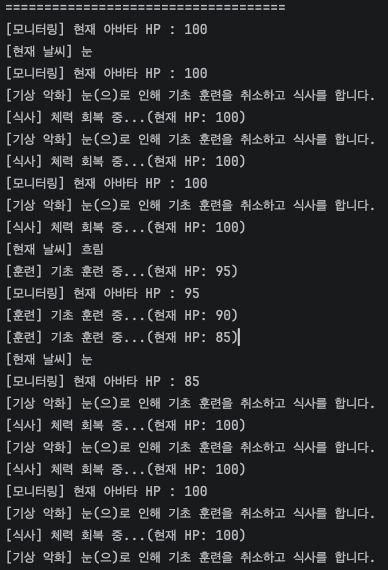

### 풀스택 2주차 과제

1주차에 제작하였던 '운동 선수 아바타 만들기 프로그램'을 기반으로 비동기 프로그램으로 만들어보는 과제를 진행하였다.
날씨 변화 스레드와 선수의 체력 변화 스레드 두 개가 독립적으로 동작한다.
두 스레드는 공유 변수(체력 & 날씨)를 통해 비동기적으로 상호 작용한다.

#### 스레드 구조
총 3개의 스레드가 동시에 독립적으로 동작하며 각자의 역할을 수행한다.
1. Main Thread
   - 관전 및 모니터링 담당 스레드
   - Training Thread 와 Weather Thread를 가동하고, 3초마다 아바타의 체력을 출력한다.
2. Training Thread
   - 훈련 스레드
   - 1.5초 마다 아바타의 체력과 현재 날씨를 확인하여 훈련(HP -5) 또는 식사(HP + 20)을 결정한다.
3. Weather Thread
   - 날씨 스레드
   - 5.0초 마다 날씨(맑음, 흐림, 비, 눈) 중 하나를 랜덤하게 선택합니다.

#### 개발 중 이슈
1. Scanner 입력이 씹히는 현상
   - **문제**: 최초로 떠올렸던건, 훈련과 날씨 스레드만 백그라운드에서 동작하도록 하고, 식사는 따로 사용자에게 입력을 받아(예를 들어 1을 누르면 식사를 하고 HP가 20 증가) 비동기 프로그램을 만드려고 했는데, 두 개 스레드에서 로그를 계속 출력하다보니, 메인 스레드에서 입력과 출력이 뒤엉켜 입력이 무시되는 상황이 발생했다.
   - **해결**: 입력을 포기하고, 날씨에 따라 아바타의 행동(훈련 or 식사)가 결정되도록 코드를 수정하였다.
2. NullPointerException 발생
   - 
   - **문제**: Training Thread는 1.5초마다 반복되어 날씨에 따라 아바타의 행동을 결정하는데, Weather Thread가 5초마다 반복되어 아바타의 currentWeather(현재 날씨)값이 초기화되지 않아 NullPointerException이 발생하는 문제가 있었다.
   - **해결**: Training Thread가 날씨를 조회한 직후, 만일 날씨 변수가 null이면 아래 코드를 무시하도록 예외 처리를 적용했다.

#### 결과

#### 회고
1주차 과제를 끝내고 나서, 생각보다 자바가 손에 잘 안 익어 있다는 걸 느꼈다. 
문법도 그렇고 객체지향적으로 코드를 짜는게 아직 부족하다고 느껴져서, 무작정 다음 과제로 넘어가기보다는 전체 교재를 다시 복습하는 시간을 가졌다.
개념을 다시 정리하고 LLM을 활용해서 개념별 구현 문제를 만들어 구현해보며, 문법과 형식을 익히려고 했다. 그 과정에서 헷갈렸던 문법이나 구조들이 조금씩 정리됐다.
  
복습 이후에는 1주차 과제에서 받았던 코드 리뷰 피드백을 바탕으로 기존 코드를 수정했다. 
접근 제어자를 사용하고 입력 처리와 객체를 분리하며 예외 처리를 적용했다. 코드 리뷰를 처음 받아봤는데, 확실히 처음 개발할 때 놓치고, 몰랐던 부분들이 많음을 느꼈다.
  
가장 오래 고민했던 부분은 멀티스레드 환경에서 사용자 입력을 받는 구조였다. 처음에는 사용자가 콘솔에 명령어를 입력하면 실시간으로 스레드와 상호작용하는 형태를 생각했는데, 
실제로 구현해보니 콘솔 출력 로그와 Scanner 입력이 서로 꼬이면서 입력이 씹히는 문제가 계속 발생했다.
그래서 사용자의 직접 입력 대신, 아바타가 날씨 상황에 따라 행동하는 시뮬레이션 방식으로 방향을 수정했다. 
코드를 짜고 결과를 보며, 스레드 간 데이터 공유나 동기화 흐름을 깊게 이해할 수 있었다.
  
실무에 도움이 되는 방향으로 프로젝트를 진행하고 싶어서 Thread를 직접 상속받기보다는 Runnable 인터페이스를 구현하는 방식을 사용했고, 
스레드도 필요할 때마다 새로 만드는 대신 ExecutorService를 이용해서 제한된 개수만 관리하도록 구성했다.
